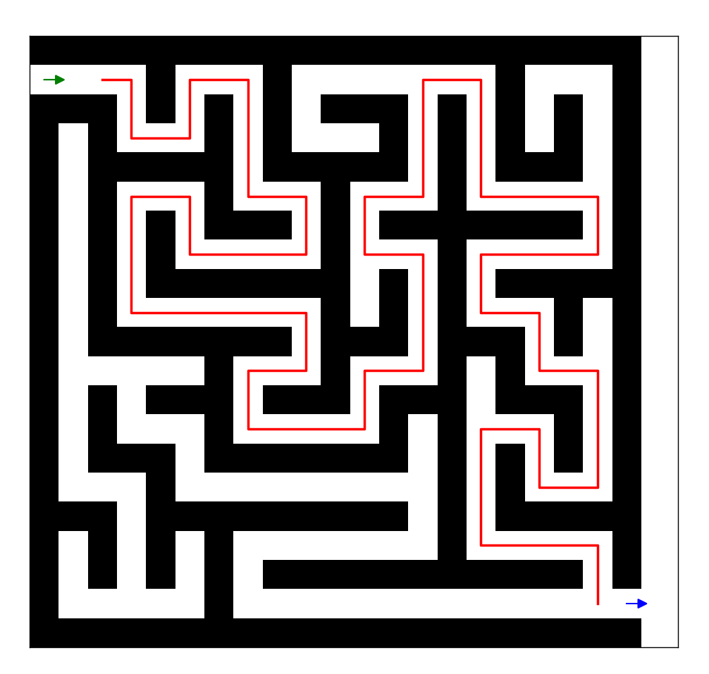

# _**Maze**_

## ✏️ Описание проекта
Проект предназначен показать работу _двух_ лабиринтов.

### 📋 Задание
Найти кратчайший путь из лабиринта.

### 📟 Функциональные возможности
- Первый лабиринт (путь - _mazes/maze_one_):

  - **Может** ✅: 
      - Изменять размер.
      - Генерировать разные пути.
      - Находит кратчайший путь \
        (проводя этот путь красной линией).
      - Запускать анимацию прохождения пути \
        (С помощью библиотеки _Matplotlib_)
  - **Не может** ❌:
    - Показывать все пути, по которым может пройти. 

- Второй лабиринт (путь - _mazes/maze_two_): \

  - **Может** ✅:
    - Находит кратчайший путь \
        (проводя этот путь красной линией).
    - Показывать все пути, по которым может пройти.
    - Отобразить шаги в консоли лабиринт в _консоли_
    - Отобразить координаты кратчайшего пути в _консоли_
    - Отправлять gif-изображение прохождения пути \
        (С помощью библиотеки _Pillow_)
  - **Не может** ❌:
    - Изменять размер.
    - Генерировать разные пути.
